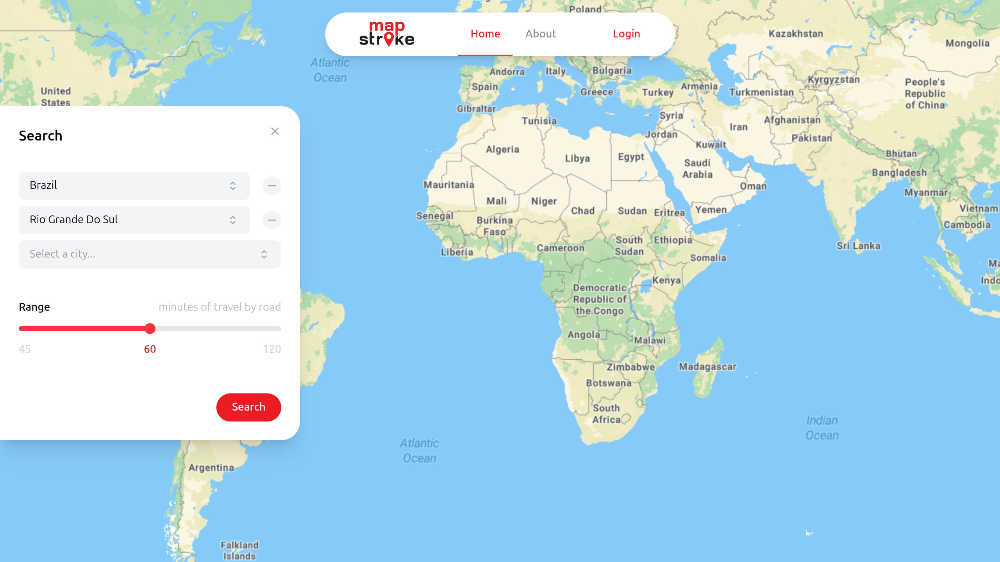
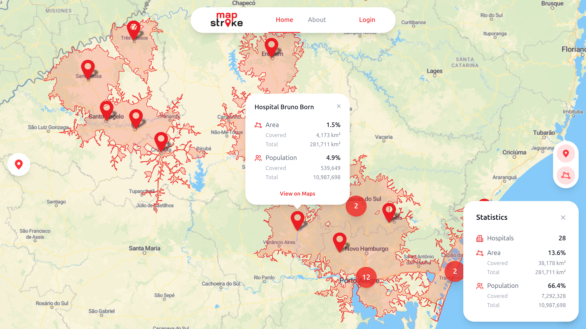
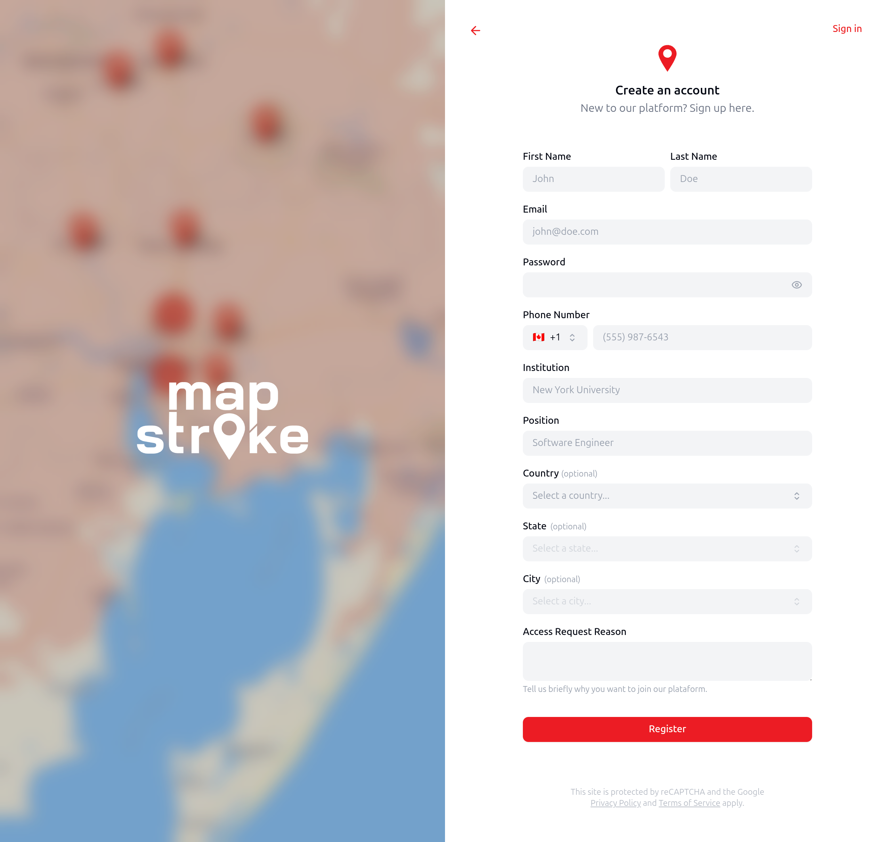
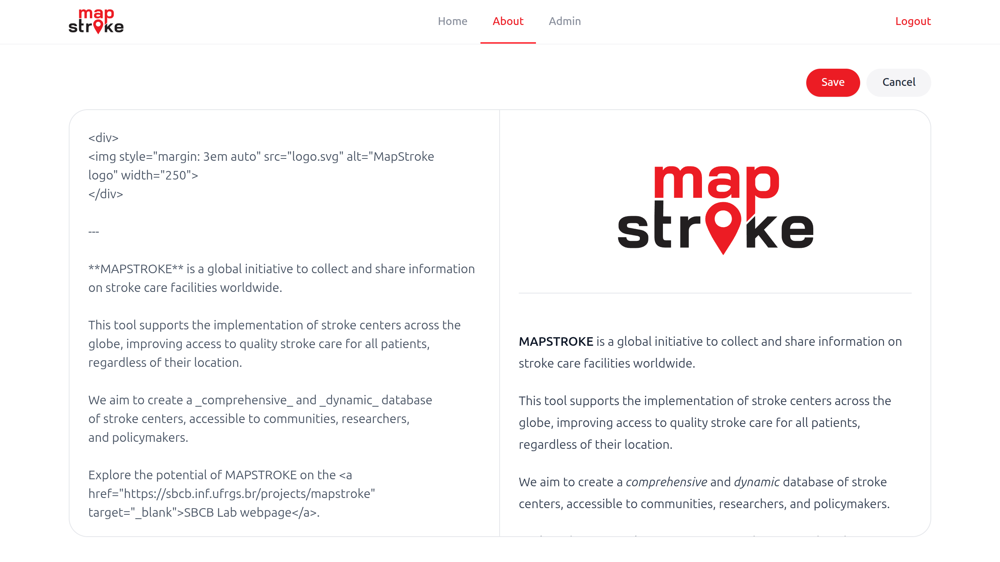
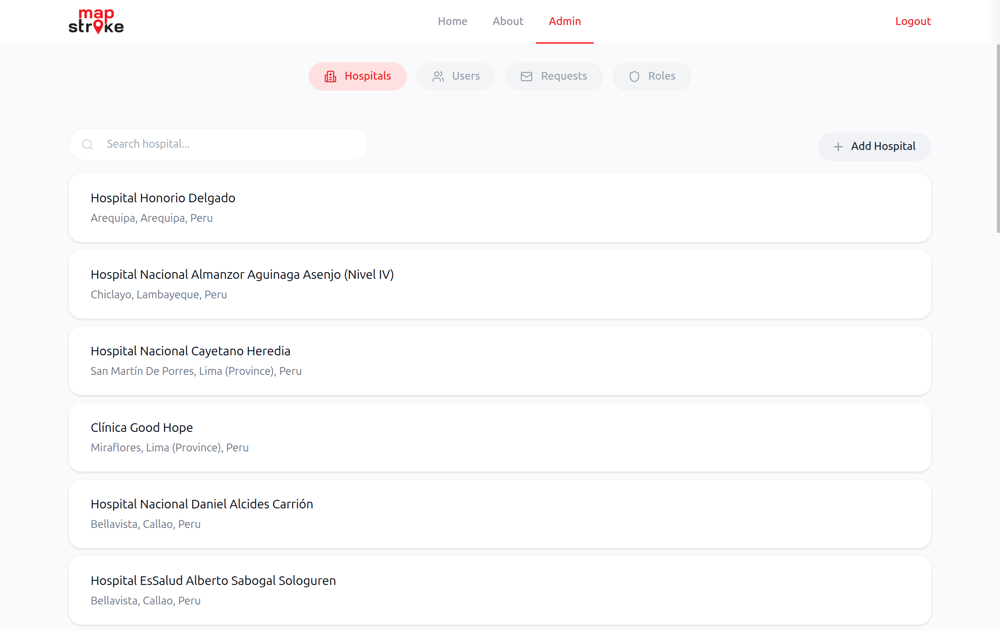
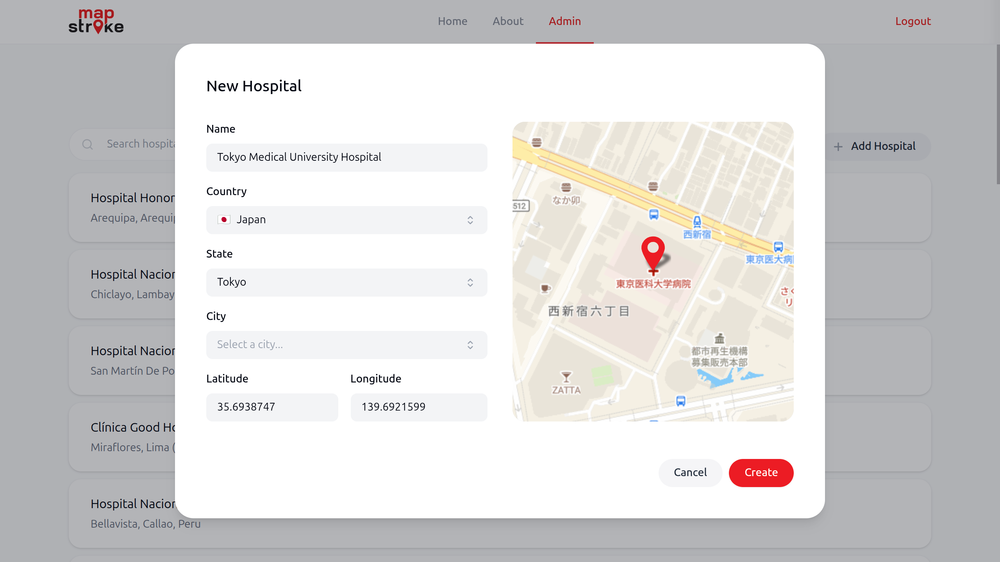
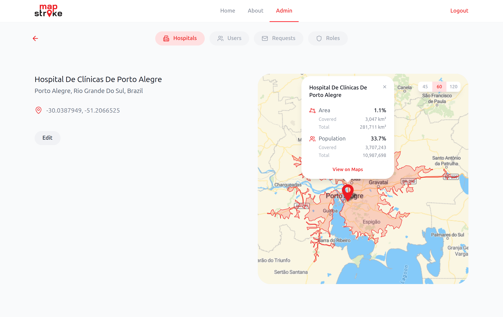
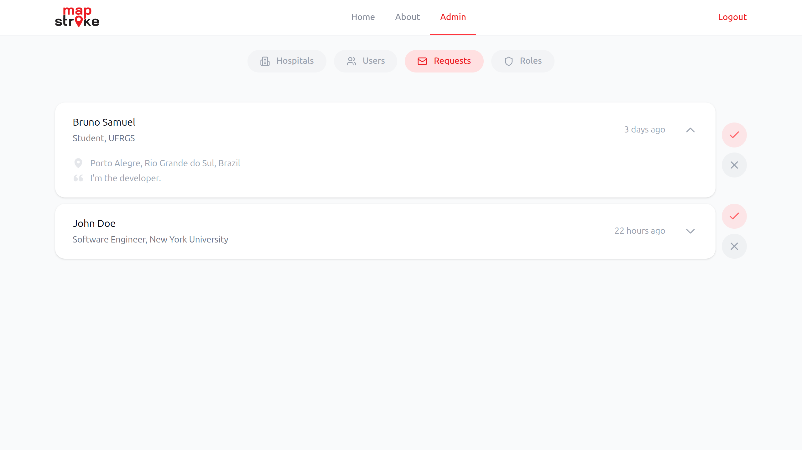
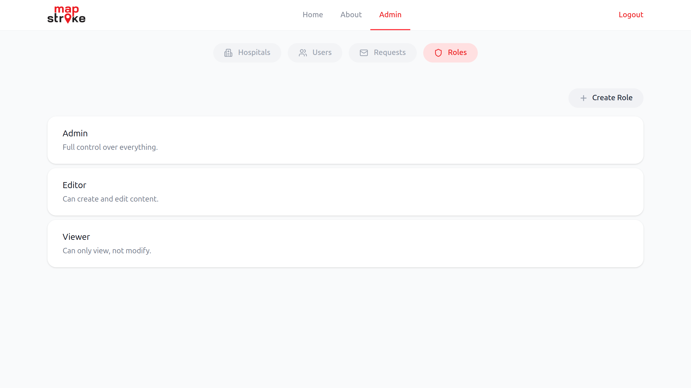
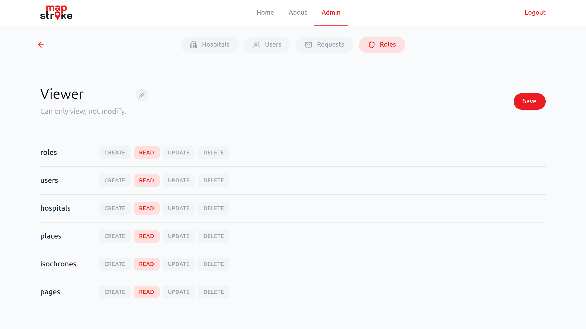

O MapStroke é uma plataforma de mapeamento de cobertura de hospitais para doenças tempo-sensíveis como o AVC. O objetivo principal do projeto é facilitar a inclusão de centros de atendimento para essa e outras doenças tempo-sensíveis, otimizando a alocação de recursos e permitindo grandes impactos na saúde da população.

A plataforma consiste em uma aplicação web com interface moderna e de fácil utilização. O *front end* da plataforma foi desenvolvido pelo bolsista utilizando *SvelteKit v2* como *framework*, junto com *TypeScript* para tipagem segura, *Tailwind CSS v4* para estilização e *Leaflet* para a exibição de mapas, que por sua vez são fornecidos pelo *MapTiler*. O *back end* e a pesquisa são desenvolvidos em paralelo com o *front end* por outros membros do *SBCB Lab* de forma contínua, com reuniões semanais de alinhamento.

Ao acessar o site do MapStroke, o usuário é recebido pela página principal, que consiste em um mapa interativo em tela cheia (com interação inicialmente desativada), um menu de navegação do site ao topo e um botão à esquerda. Ao clicar no botão, é exibida a janela de busca de isócronos. Através desta, é possível escolher dentre as localizações disponíveis (atualmente 9 países), fazer uma busca em nível de país, estado, cidade ou hospital. O resultado para um país incluirá todos os resultados de seus estados e assim por diante. Também é possível determinar o alcance da cobertura dos hospitais, medido em minutos de viagem por estrada, que podem ser 45, 60 ou 120 minutos.

<em>Figura 1: Mapa interativo e janela de busca</em>

Como resultado da busca, são marcados no mapa todos os hospitais da localização escolhida onde o atendimento é possível. O servidor então calcula a mescla das áreas alcançáveis por estrada a partir desses hospitais dentro do tempo selecionado, resultando em polígonos conhecidos como isócronos, que são por fim desenhados no mapa pela aplicação. Se desejado, é possível ocultar os isócronos e os marcadores através dos botões à direita.

Nesse momento, o usuário é livre para navegar no mapa dentro da área buscada. Além dos marcadores e isócronos, é exibido também, no canto inferior direito, uma janela de estatísticas, que informa o número de hospitais, área e população coberta da zona de interesse, incluindo os valores absolutos e relativos. Ao clicar em um marcador, é possível consultar as estatísticas de cobertura de um hospital específico, assim como seu nome e um link para vizualizá-lo no *Google Maps*.

<em>Figura 2: Resultado da busca de isócronos</em>

A plataforma conta com um sistema de autenticação baseado em pedidos de acesso. Ao clicar em *Login* no menu de navegação, o usuário é redirecionado à página de autenticação e, clicando em *Sign up* no topo, é levado ao formulário de registro. Para criar uma conta, além do e-mail e senha de acesso, é pedido também nome completo, telefone, instituição na qual atua, sua posição nesta, um breve motivo para o pedido de acesso e, opcionalmente, país, estado e cidade. Após a submissão, é informado ao usuário que seu pedido foi enviado e está sob avaliação.

Dada a aprovação de um administrador, o acesso à conta pode ser feito na página de *Login*. Nessa mesma página, é possível também alterar a senha clicando em *Forgot password?* e inserindo o e-mail da conta. Será enviado um e-mail com um link para a página de definição da nova senha, que valida o token contido no link como um parâmetro de busca e permite a alteração.

<em>Figura 3: Formulário de registro</em>

Feita a autenticação, o usuário tem acesso de administrador a todas as funcionalidades da plataforma. Esse é um comportamerto temporário, dado que o sistema de permissões de usuário está em desenvolvimento.

A página *About* é inicialmente uma página estática informativa  com uma breve introdução ao projeto e aos envolvidos. Um administrador, no entanto, tem acesso a um botão *Edit* que ativa o modo de edição. Nesse modo, é possível atualizar o conteúdo completo da página em uma visão dividida, com um editor em linguagem *Markdown* à esquerda e o resultado final à direita atualizado em tempo real. Para confirmar as alterações, clica-se em *Save* e, para descartar, em *Cancel*.

<em>Figura 4: Editor da página About</em>

Administradores têm acesso também a uma nova página *Admin*, que contém subpáginas para gerenciamento de diferentes áreas da plataforma: hospitais, usuários, pedidos de acesso e permissões.

Na aba de hospitais, são exibidos todos os hospitais cadastrados na base de dados em uma lista com carregamento sob demanda. Cada entrada da lista contém o nome do hospital, sua cidade, estado e país. É possível também pesquisar por hospitais através do campo de busca textual, tanto por nome quanto por localização.

<em>Figura 5: Página de gerenciamento de hospitais</em>

O botão *Add Hospital* abre uma janela onde é possível adicionar um novo hospital à base de dados, especificando um nome, país, estado, cidade, latitude e longitude. Os campos de localização em toda a aplicação são *comboboxes* customizados, pequenas janelas de seleção com opções predeterminadas e um campo de busca. As opções de estado disponíveis dependem do país selecionado, assim como as cidades dependem do estado.

Ao fazer uma alteração nos campos de localização ou de coordenadas, esta é refletida em tempo real no mini-mapa interativo à direita do formulário, que se dirigirá a área selecionada. O mapa pode ser navegado livremente e possui um marcador deslocável, que ao segurar e arrastar, se move junto com o mapa, atualizando as coordenadas devidamente.

Confirmada a criação do hospital, uma nova entrada é adicionada à lista. Nesse momento, o servidor inicia o cálculo dos isócronos para o novo hospital.

<em>Figura 6: Janela de criação de hospital</em>

Todo hospital cadastrado possui uma página própria, que pode ser acessada clicando em seu respectivo item na lista. Nessa página, à esquerda, se encontram todas as informações vistas anteriormente, como nome, localização e coordenadas. 

À direita, um mapa (com navegação desativada) mostra a localização do hospital junto com o isócrono calculado a partir desta. O usuário pode alternar entre alcances, similarmente à busca da página principal, através dos botões no canto superior direito do mapa. É possível também, clicando no marcador, consultar as estatísticas de cobertura do hospital.

Ainda nessa página, um botão *Edit* fica disponível para permitir a alteração de qualquer informação do hospital, o que é feito em uma janela idêntica à de criação, já preenchida com os dados atuais, com a única diferença sendo a presença de um botão *Delete* que possibilita a exclusão do hospital. Caso a localização mude, os isócronos são recalculados.

<em>Figura 7: Página de hospital</em>

Na aba *Requests* da página de administração, se encontram todos os pedidos de acesso pendentes de avaliação. Cada item exibe o nome completo do dono da requisição, sua instituição e posição, assim como há quanto tempo ele foi feito. Ao expandir o elemento com um clique, é possível visualizar também a localização e justificativa do pedido.

Um administrador pode aprovar ou rejeitar pedidos através dos respectivos botões ao lado direito de cada item. Caso aprovado, um novo usuário é criado e pode ser visualizado na lista de usuários na aba *Users*. Caso contrário, o pedido é apenas apagado.

<em>Figura 8: Página de requisições de acesso</em>

Na última aba se encontram os *Roles* (papéis), estes representam conjuntos de permissões que podem ser atribuídos a usuários, a fim de definir diferentes tipos de acesso. Cada item da lista contém o nome e uma breve descrição do papel.

O botão *Create Role* abre uma janela similar à de criação de hospital, porém apenas com um campo de nome e de descrição. Após preencher ambos campos, pode-se criar um papel, que inicialmente não possui nenhuma permissão. A definição destas é feita na página do papel.

<em>Figura 9: Página de gerenciamento de papéis</em>

Assim como os hospitais, cada papel tem uma página própria, onde é possível editar suas permissões. Uma permissão é definida por um recurso, sendo eles: papéis, usuários, hospitais, localizações, isócronos e páginas; e uma ação: leitura, criação, edição e exclusão.

Na página, há uma estrutura similar a uma tabela, onde cada linha representa um recurso e cada coluna uma ação. Cada célula da tabela é um botão, que pode estar ativado (vermelho) ou desativado (cinza), e determina se um usuário com esse papel poderá realizar essa ação sobre esse recurso. Por exemplo, ao desativar a ação *CREATE* do recurso *hospitals*, o botão *Add Hospitals* na página de hospitais será desativado, pois o usuário não tem permissão para criação de hospitais.

As alterações podem ser salvas pelo botão *Save*, que só estará ativo quando houverem modificações. O botão com ícone de lápis ao lado do nome permite a edição do nome e da descrição, em uma janela idêntica à de criação, com exceção da inclusão do botão *Delete* que deleta o papel.

Como mencionado anteriormente, o sistema de permissões é recente está em desenvolvimento. Os papéis podem ser definidos e modificados, mas ainda não terão efeito sobre os usuários.

<em>Figura 10: Página de edição de papel</em>

